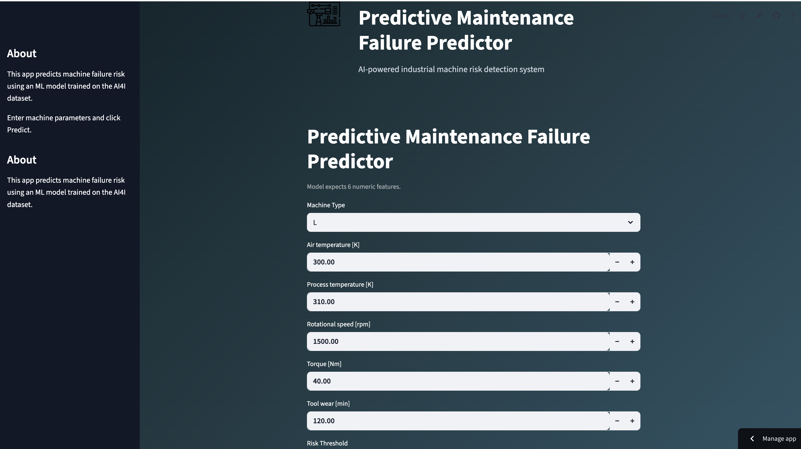
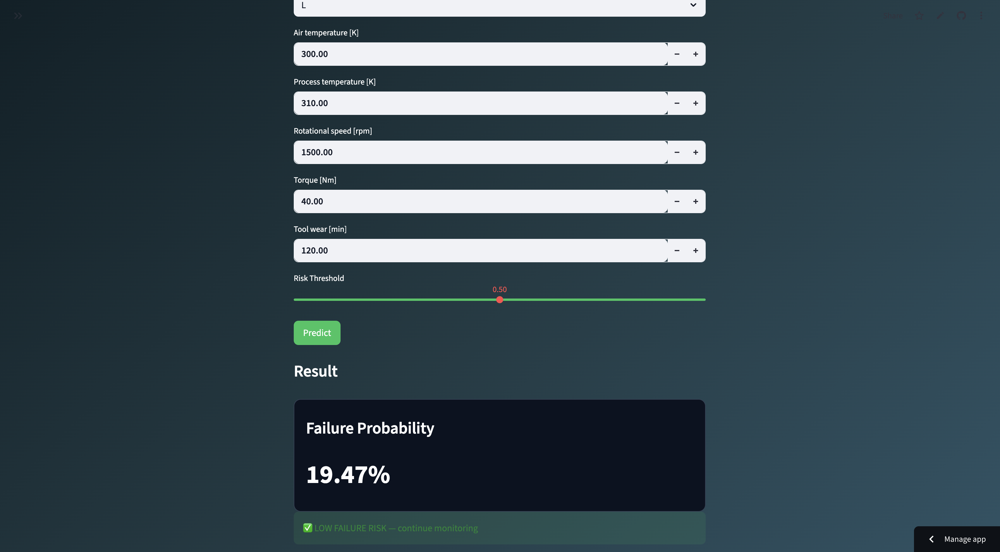

# ✅ **FINAL README (copy everything below)**

````markdown
# 🔧 Predictive Maintenance Failure Predictor

[](https://predictive-maintenance-app-mmvekivq54jgrdehkwyaxz.streamlit.app/)


An **end-to-end Machine Learning web application** that predicts **industrial machine failure risk** using the **AI4I 2020 Predictive Maintenance dataset**.

Built with **Logistic Regression**, deployed via **Streamlit Cloud**, and designed as a **real-world portfolio project** demonstrating the full ML lifecycle.

---

## 🚀 Live Demo

👉 **Try the app here:**  
https://predictive-maintenance-app-mmvekivq54jgrdehkwyaxz.streamlit.app/

---

## 🖼️ Screenshots

### 📊 Input Interface


### 🤖 Prediction Result


---

## ✨ Key Features

- Interactive **Streamlit web interface**
- Real-time **machine failure probability prediction**
- Adjustable **risk threshold slider**
- Automatic **LOW / HIGH risk classification**
- Model loaded from saved **scikit-learn pipeline**
- Fully deployed online for public access

---

## 🧠 Machine Learning Model

- Algorithm: **Logistic Regression**
- Dataset: **AI4I 2020 Predictive Maintenance**
- Pipeline includes:
  - Feature preprocessing
  - Model training
  - Probability prediction
- Saved using **Joblib**

---

## 📥 Model Inputs

The app predicts failure risk based on:

- Machine Type (L / M / H)
- Air Temperature [K]
- Process Temperature [K]
- Rotational Speed [rpm]
- Torque [Nm]
- Tool Wear [min]

---

## 📤 Output

- Failure probability (0–100%)
- Risk label:
  - 🟢 LOW FAILURE RISK
  - 🔴 HIGH FAILURE RISK
- Recommended action guidance

---

## 🧰 Tech Stack

- **Python**
- **Pandas / NumPy**
- **scikit-learn**
- **Streamlit**
- **Joblib**

---

## ⚙️ Run Locally

Clone the repo:

```bash
git clone https://github.com/habtamuadargaso/predictive-maintenance-streamlit.git
cd predictive-maintenance-streamlit
````

Create virtual environment:

```bash
python3 -m venv .venv
source .venv/bin/activate
```

Install dependencies:

```bash
pip install -r requirements.txt
```

Run the app:

```bash
python3 -m streamlit run app.py
```

---

## 📁 Project Structure

```
predictive-maintenance-streamlit/
├── app.py
├── requirements.txt
├── README.md
├── model/
│   └── pipeline.joblib
└── assets/
    ├── app_input.png
    └── app_result.png
```

---

## 👤 Author

**Habtamu Dargaso**
Data Scientist | Machine Learning Engineer

---


